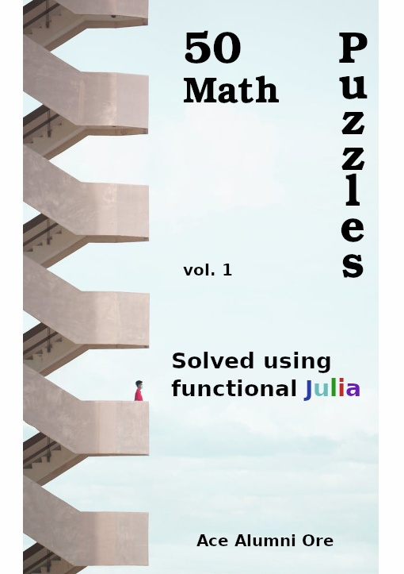

# mybook-vol.1
50 Math Puzzles Solved using functional Julia

## book cover

## table of contents

  
   
  

# License
Copyright [2022] [J. Manuel Caeiro D. P.]

 This work is licensed under a <a rel="license" href="http://creativecommons.org/licenses/by-nc-nd/4.0/">Creative Commons Attribution-NonCommercial-NoDerivatives 4.0 International License</a>.
