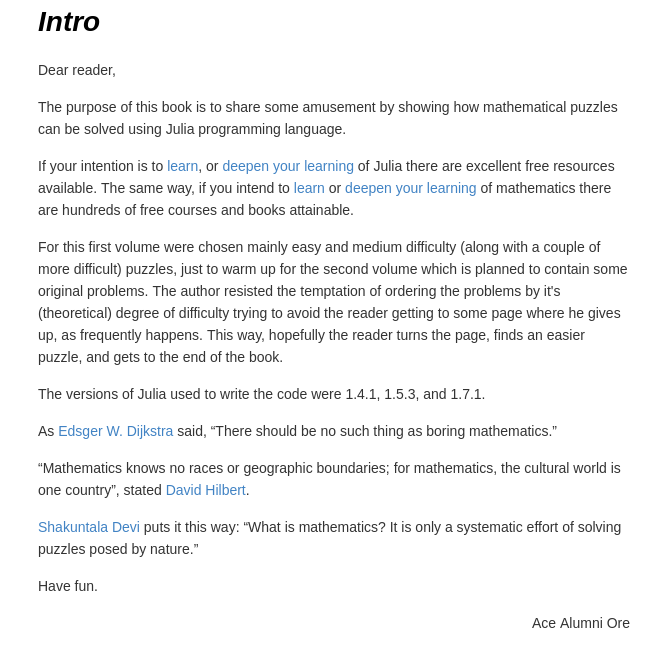

# mybook-vol.1
50 Math Puzzles Solved using functional Julia

## book cover

## table of contents

  
   
  

## intro

## sample puzzle

  
  

## get the book
Liked the preview? Want the book? Simple.

For a small donation of 3 EUR - or 4 USD, or 3 GBP, or 5 AUD, or 5 CAD, or ... - I'll send you a beautiful epub file you can read (and play with) on your pc, tablet, or smartphone.

Email me to: manuelcaeiro[at]workmail[dot]com

P.S.: Larger donations will also be accepted. :)

P.S.2: The ebook is planned also to be for sale soon at Leanpub. (I'll give you notice of it here.)

# License
Copyright [2022] [J. Manuel Caeiro D. P.]

 This work is licensed under a <a rel="license" href="http://creativecommons.org/licenses/by-nc-nd/4.0/">Creative Commons Attribution-NonCommercial-NoDerivatives 4.0 International License</a>.
